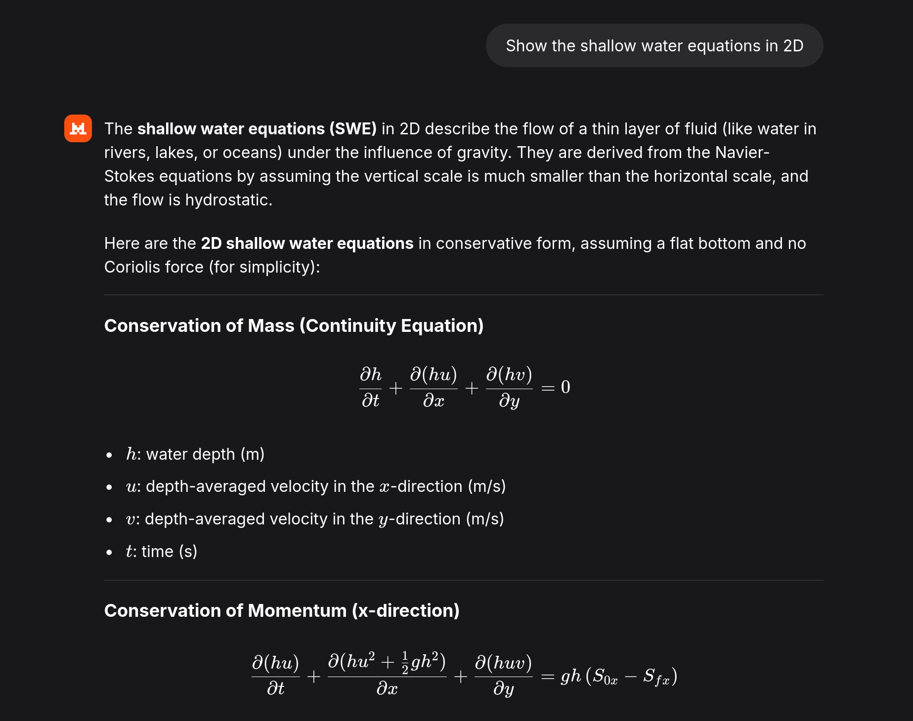
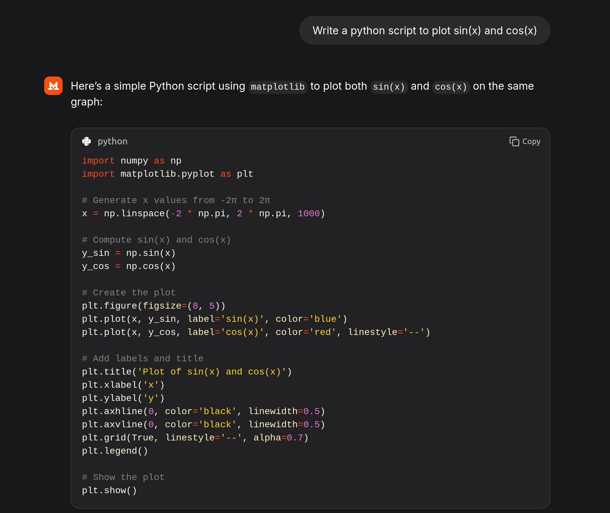
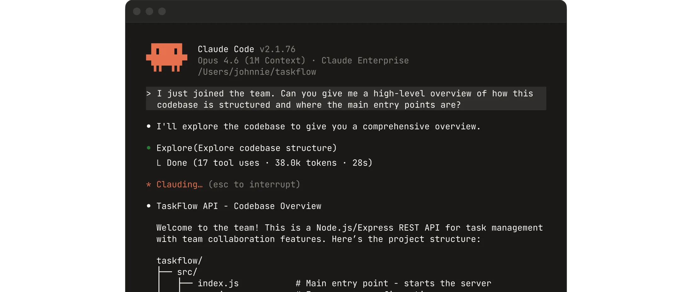
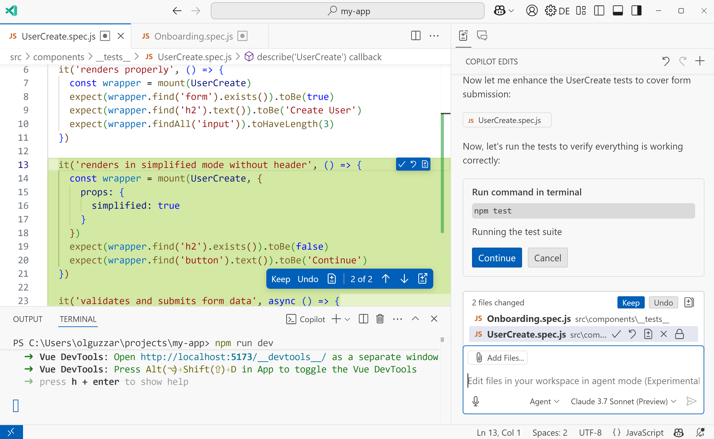
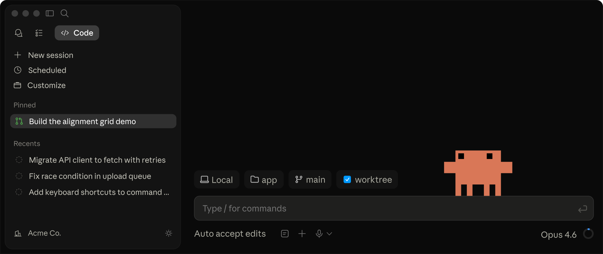
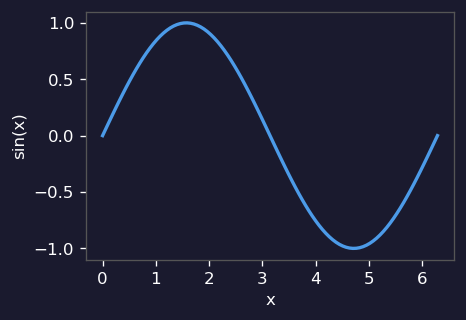
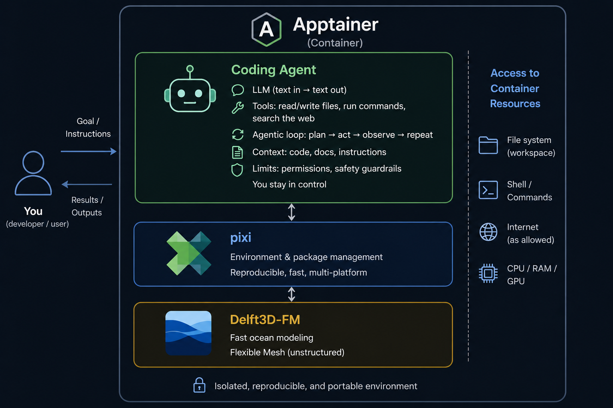

## You've probably done this

{fig-align="center" height="580"}

## And this

{fig-align="center" height="580"}

## But this is where it gets interesting

**Coding agents**

:::: {.columns}
::: {.column width="33%"}
**In your terminal**

{fig-align="center" width="100%"}
:::
::: {.column width="33%"}
**In VS Code**

{fig-align="center" width="100%"}
:::
::: {.column width="34%"}
**As a desktop app**

{fig-align="center" width="100%"}
:::
::::

## What is a coding agent?

An LLM is simple: **text in → text out**

A coding agent adds:

- **Agentic loop** — plan → act → observe → repeat until done
- **Tools** — read/write files, run commands, search the web
- **Context** — your code, docs, and instructions fed in automatically
- **Limits** — permissions, safety guardrails — you stay in control

## (1) The agentic loop in action {.smaller}

:::: {.columns}
::: {.column width="58%"}
**You:** *"plot sin(x) and save it"*

**Agent writes** `plot_sin.py`:
```python
import numpy as np, matplotlib.pyplot as plt
x = np.linspace(0, 2*np.pi, 100)
plt.plot(x, np.sin(x)); plt.savefig('sin.png')
```

**Runs it:**
```
$ python plot_sin.py
ModuleNotFoundError: No module named 'matplotlib'
```

**Fixes it:**
```
$ pip install matplotlib
$ python plot_sin.py   ✓
```
:::
::: {.column width="42%"}
{fig-align="center" width="100%"}
:::
::::

## (2) Tools — the agent's hands {.smaller}

| | |
|---|---|
| **Read** | any file — scripts, model input, netCDF output |
| **Edit / Write** | modify or create files — code, run scripts, configs |
| **Bash** | run any shell command — `python`, `pip`, `git`, model runs |
| **Web** | search for docs, fetch a specific page or file |
| **Vision** | inspect figures, screenshots, diagrams — check plausibility, not just presence |
| **Subagents** | spawn parallel agents for larger tasks *(advanced)* |
| **MCP** | plug in external tools — databases, APIs, custom tools *(advanced)* |

## (3) Context — what the agent sees

You talk to a colleague who has already read your code.

- **Your files** — reads scripts and configs directly; no copy-pasting
- **Command output** — sees error messages, print statements, test results
- **Instructions** — `CLAUDE.md`: your project rules, written once, always applied
- **Conversation** — builds on earlier steps within a session

. . .

The more context it has, the more useful it is *(at least until ~70% of the context window)*

## (4) Limits — you stay in control

- **Permission prompts** — [the agent asks before editing or running anything]{style="font-size:0.8em"}
- **You can say no** — [review each proposed action, approve or deny]{style="font-size:0.8em"}
- **Privacy** — [your code is sent to the LLM provider; check their policy]{style="font-size:0.8em"}
- **Mistakes happen** — [always work in a git repo so you can roll back]{style="font-size:0.8em"}
- **Sandboxed containers** — [this repo gives you a safe space to experiment]{style="font-size:0.8em"}

## Who offers coding agents?

| | Chat | Coding agent |
|---|---|---|
| **Microsoft / GitHub** | Copilot Chat | GitHub Copilot |
| **OpenAI** | ChatGPT | Codex CLI |
| **Anthropic** | Claude | Claude Code |
| **Google** | Gemini | Gemini CLI |
| **Mistral** | Le Chat | Mistral Vibe CLI |

## Current models {.smaller}

| | Fast & cheap | Balanced | Powerful |
|---|---|---|---|
| **Anthropic** | Haiku | Sonnet | Opus |
| **OpenAI** | o4-mini | GPT-4o | GPT-5 |
| **Google** | Gemini Flash | Gemini Pro | Gemini 3 Pro *(2M ctx)* |
| **Mistral** | Mistral Small | Mistral Large | *(open-weight available)* |
| **Microsoft** | | *(OpenAI & Anthropic models)* | |

**Choosing a model:**

- **Quick question, autocomplete** → fast & cheap
- **Everyday coding tasks** → balanced
- **Large codebase, complex refactor** → powerful

## CliCodingAgents

::: {style="font-size: 0.6em; margin-top: -0.8em; margin-bottom: 0.3em;"}
a ready-made environment: coding agent + pixi + Delft3D-FM
:::

{fig-align="center" height="460"}

::: {style="font-size: 0.55em; text-align: center; margin-top: 0.3em;"}
<https://github.com/robot144/CliCodingAgents>
:::

## Why Apptainer?

- **Already installed on many HPC clusters** — [no root access or admin required]{style="font-size:0.8em"}
- **Container image in a single `.sif` file** — [easy to share and archive]{style="font-size:0.8em"}
- **File access limited to a defined scope** — [for CliCodingAgents: current working directory only]{style="font-size:0.8em"}
- **Pre-installed software** — [coding agent, tools, and Delft3D-FM ready to go]{style="font-size:0.8em"}
- **Pre-installed pixi** — [add your own packages with `pixi init; pixi install python`]{style="font-size:0.8em"}

## Installing Apptainer on a Windows 11 laptop {.smaller}

Enable WSL2, install Ubuntu from the Microsoft Store, then install Apptainer via the official PPA:

```bash
sudo apt update
sudo apt install -y software-properties-common
sudo add-apt-repository -y ppa:apptainer/ppa
sudo apt update
sudo apt install -y apptainer
```

Then run a container:

```bash
# General command
apptainer shell claude-cli.sif

# CliCodingAgents provides convenience scripts
bash_claude.sh        # launches the Claude Code container
```

::: {style="font-size: 0.7em; margin-top: 0.5em;"}
Full docs: <https://apptainer.org/docs/admin/latest/installation.html>

GPU support (`--nv` flag for NVIDIA): <https://apptainer.org/docs/user/latest/gpu.html>
:::

## Agent + Delft3D-FM in action

<video controls width="100%" style="max-height:560px;">
  <source src="figures/Screencast from 2026-04-17 23-50-17.mp4" type="video/mp4">
</video>

## Delft3D-FM container — what's inside

- **Binaries** — [`dflowfm`, `dimr`, `delwaq`, `delpar`, `rr`, `rtc` + run scripts]{style="font-size:0.8em"}
- **Parallel runs** — [Intel MPI included; `run_dimr.sh -c <cores>` for multi-core]{style="font-size:0.8em"}
- **Manuals & PDF tools** — [user manuals at `/opt/`; `poppler` for PDF reading by the agent]{style="font-size:0.8em"}
- **Example models** — [from the Delft3D-FM repository, ready to explore and modify]{style="font-size:0.8em"}
- **Python & Julia via pixi** — [post-processing with xarray, matplotlib, netCDF4, ...]{style="font-size:0.8em"}
- **`CLAUDE.md`** — [tells the agent key paths, run commands, and model conventions]{style="font-size:0.8em"}

## Can I do this myself with VS Code? {.smaller}

Almost — set it up manually on any Linux machine or cluster:

- **VS Code extensions** — [Remote-SSH to connect to a cluster; GitHub Copilot or Claude Code for the agent]{style="font-size:0.8em"}
- **`CLAUDE.md` / `AGENTS.md`** — [create a project instructions file so the agent knows your setup]{style="font-size:0.8em"}
- **Download manuals** — [Delft3D-FM user manual and technical reference from the Deltares website]{style="font-size:0.8em"}
- **Install pixi** — [`curl -fsSL https://pixi.sh/install.sh | bash`; add Python, Julia, plotting libs]{style="font-size:0.8em"}
- **Install poppler** — [`sudo apt install poppler-utils` so the agent can read PDF manuals]{style="font-size:0.8em"}
- **Install Delft3D-FM** — [if not already available; contact Deltares for the binaries]{style="font-size:0.8em"}
- **Add example models** — [copy from the Delft3D-FM examples folder]{style="font-size:0.8em"}

**But:**

- [has to be repeated by everyone on every cluster — in my experience still sub-optimal]{style="font-size:0.8em"}
- [`CLAUDE.md` and `pixi.toml` can be shared via git — binaries still need installing per machine]{style="font-size:0.8em"}

## Personal experience *(n=1)*

- CLI feels more productive than VS Code plugin for engineering workflows on a cluster
- **Claude** — best results in my experience 
- **Copilot** — paid by employer, convenient; selecting Claude agent in plugin helps but still sub-optimal
- **Mistral** — more open and European; LLM weights open
- Engineers potentially benefit more than developers?
- Late 2025: shifted from interesting to genuinely productive

*[Pragmatic Engineer survey 2026](https://aiproductivity.ai/news/pragmatic-engineer-survey-ai-tooling-2026/)*

## Personal experience *(n=1)* — tips {.smaller}

:::: {.columns}
::: {.column width="50%"}
**What works well**

- Be explicit about what you want
- Interrupt if the agent deviates — don't let it run too far
- Create a `plan.md` for larger tasks
- Edit `CLAUDE.md` to make context more specific to your project
- Create scripts for recurring tasks — or ask the agent to write them
- Add unit testing to `CLAUDE.md` — the agent makes logic errors; tests catch them early
- Use the agent to discuss options and learn
:::
::: {.column width="50%"}
**What doesn't work**

- Assigning big tasks with results you don't understand
- Using the agent to avoid thinking
:::
::::

## Questions?

- How much productivity can be gained for numerical modelling work?
- What mode of working fits the task and your preferences best?
- Will every engineer use coding agents a year from now?

*Please experiment to find out where you stand.*

::: {style="font-size: 0.55em; text-align: left; margin-top: 0.3em;"}
<https://github.com/robot144/CliCodingAgents>
:::

